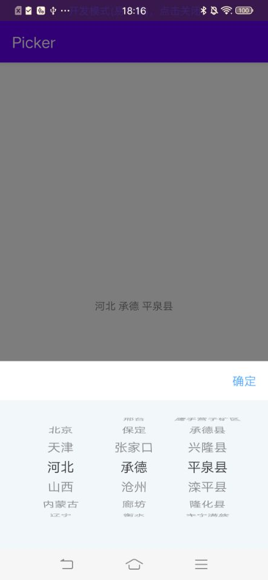

# CityPicker

离线版省份城市地区选择器(三级选择)

- 支持三级联动
- 支持打开定位至已选地区
- 支持AndroidX

## 预览



## 如何使用

拷走library直接用。

```kotlin
 SCAreaPicker(this)
            .withPickedArea(code)
            .withAreaPickedListener(object : SCAreaPicker.OnAreaPickedListener {
                @SuppressLint("SetTextI18n")
                override fun onAreaPicked(province: String, city: String, area: String, code: String) {
                   // province: 省份(省级)
                   // city: 城市(地级)
                   // area: 地区(县级)
                   // code: 地区代码(建议记录一下, 用于创建选择器时时传入已选择的地区)
                }

                override fun onAreaPickFailed() {
                }
            })
            .show()
```